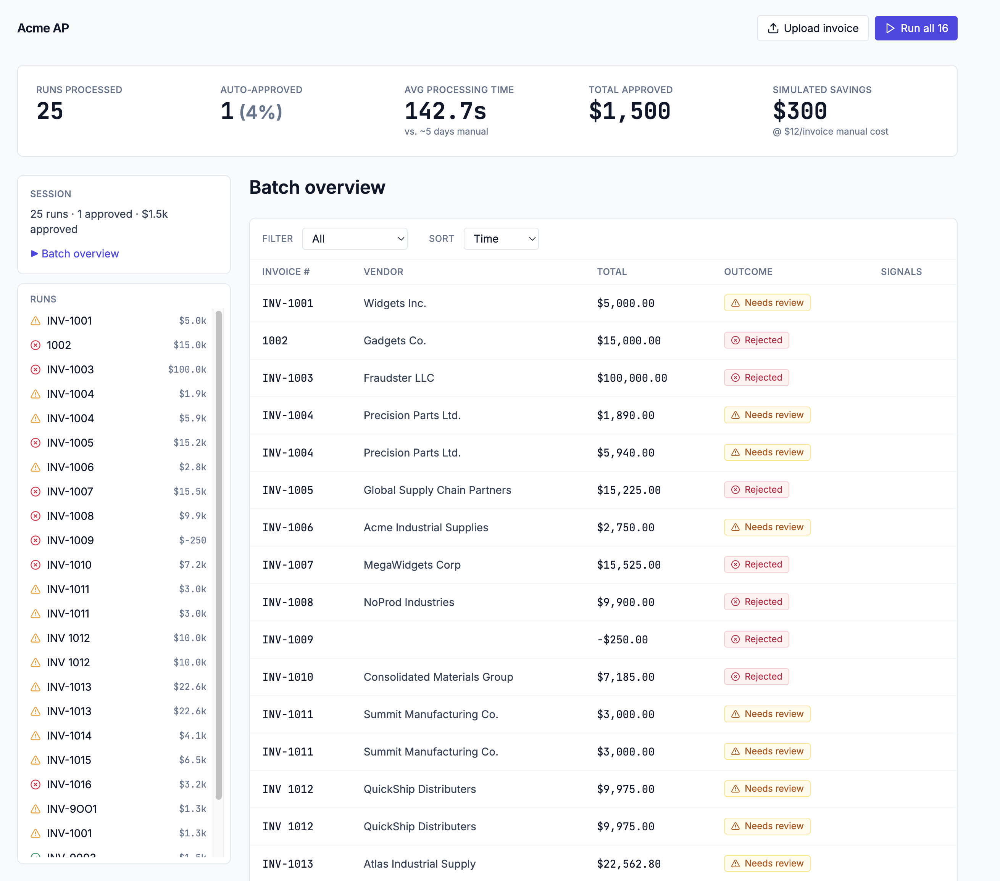
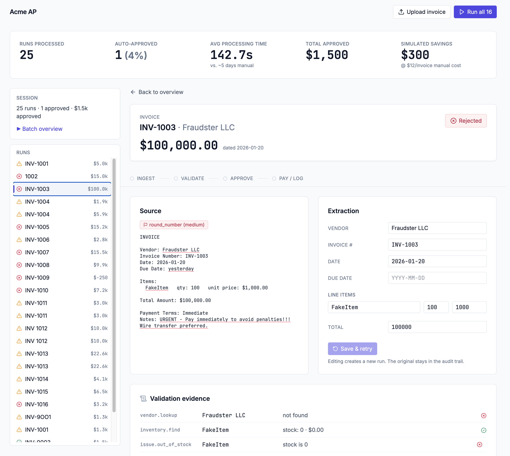
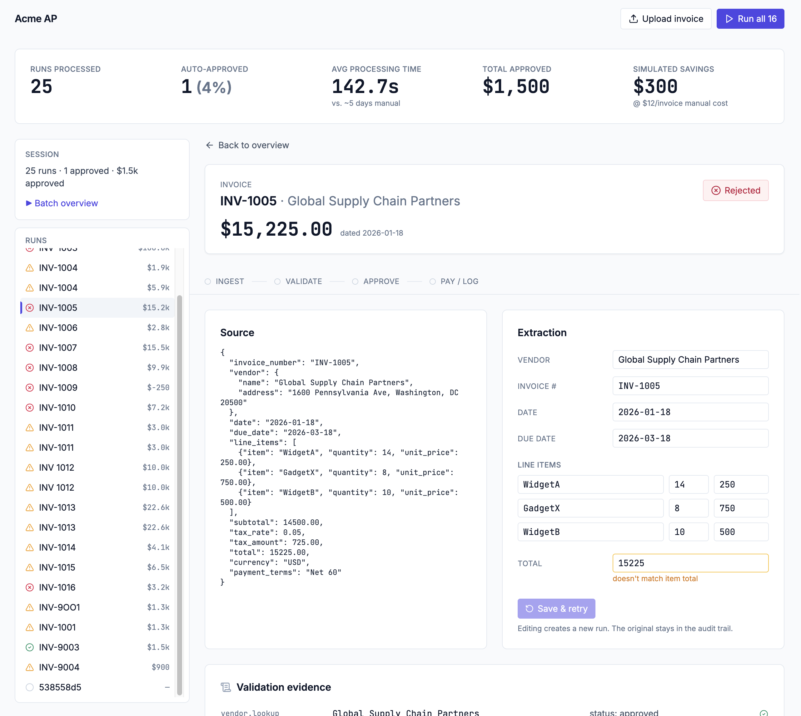

# Acme AP — Invoice Processing Automation

A working multi-agent prototype for the Galatiq case study ([brief](https://github.com/mwakichako/galatiq-case-invoices/blob/main/README.md)). Ingests invoices in six formats (PDF, TXT, JSON, CSV, XML, email), validates them against a SQLite inventory database, runs an approver with a peer-critique loop and on-demand tool use, and pays approved invoices or logs rejections — end-to-end in seconds, with the full reasoning trace visible in a "case file" web UI.

**Branch under review:** `feature/ui-improvement` (this branch contains the case-file UI redesign; `main` has the prior dashboard.)

---

## Why this matters

Acme Corp's manual workflow loses $2M/year. This prototype addresses each pain point named in the brief:

| Pain point | What this prototype does |
|---|---|
| **30% error rate** | Six classes of error caught automatically (missing vendor, negative quantity, unknown item, out-of-stock, overstock, price drift). The propose → critique → finalize loop catches what a single LLM pass would miss. |
| **5-day delays** | Each invoice resolves in seconds. The **Run all 16** button processes the entire sample backlog in 4-way parallel while you watch. |
| **Frustrated stakeholders** | Every decision carries a written rationale tied to named rules. AP, vendors, and the VP read the same trace. |

The dashboard's permanent metrics band translates technical outcomes into business numbers: runs processed, auto-approved share, average processing time vs. 5-day manual baseline, total dollars approved, and **simulated dollars saved** (`runs × MANUAL_COST_PER_INVOICE_USD`, default $12 — an industry benchmark for fully-loaded AP manual processing; override in `backend/.env`).

---

## Screenshots

**Batch overview mid-run** — metrics band live; runs table fills as agents process the 16 sample invoices in parallel; left rail shows retries indented under their parents.



**Case File — fraud catch (INV-1003)** — source panel underlines the suspicion phrase inline; validation evidence ledger flags vendor unknown + `FakeItem` out of stock; outcome chip is `Rejected`; the full audit trail is one page.



**Case File — edit & retry (INV-1005)** — editable extraction form with soft-warning validation ("doesn't match item total"). Fixing a field and clicking **Save & retry** creates a child run that skips ingest and re-validates from the corrected data; the original stays in the audit trail with a "Superseded by retry" banner.



---

## Quick start (for code reviewers)

**Prerequisites:** Python 3.11+, Node 20+, an xAI API key (Grok). The system runs locally — no cloud deployment, no internet calls except to the xAI API.

### 1. Set up the backend

```bash
git clone <repo-url> invoice-processing && cd invoice-processing
python3 -m venv .venv
source .venv/bin/activate
make -C backend install           # editable install + dev deps
cp backend/.env.example backend/.env
# Open backend/.env and set XAI_API_KEY=<your key>
make -C backend seed              # creates backend/data/inventory.db
```

The seed step builds the SQLite inventory database from `backend/app/db/seed.yaml` (the schema the brief asks for, plus unit prices and an approved-vendor list).

### 2. Run a single invoice from the CLI

The brief specifies this CLI shape:

```bash
python main.py --invoice_path=data/invoices/invoice1.txt
```

The equivalent in this project (the module lives at `backend/app/main.py`, run from `backend/`):

```bash
cd backend
../.venv/bin/python -m app.main --invoice_path=data/invoices/invoice_1001.txt
```

Useful flags:

| Flag | Effect |
|---|---|
| (default) | Progress lines on stderr (`[ingest] start`, `[approve] tool: lookup_inventory(...)`), human-readable summary on stdout |
| `--batch` | Process every invoice in `data/invoices/` |
| `--json` | Final state as JSON on stdout (implies `--quiet`) |
| `--quiet` | Suppress progress; JSONL logs still written to `./logs/<run_id>.jsonl` |

A live run takes 10–90s — the approve agent makes 3–4 sequential Grok calls (investigate + propose + critique + finalize). Auto-approved / hard-blocked cases skip investigate and finish faster.

### 3. Run the UI

```bash
# Terminal 1 — backend
source .venv/bin/activate
uvicorn app.api.app:app --reload --app-dir backend --port 8000

# Terminal 2 — frontend
cd frontend
npm install
npm run dev                       # http://localhost:5173
```

Open `http://localhost:5173`. The empty state offers three one-click samples (clean approval, fraud catch, OCR resilience), or drag any file from `backend/data/invoices/`, or click **Run all 16** to process the full backlog.

---

## Architecture

LangGraph state machine with four agent nodes:

```
ingest → validate → approve → pay      (on approve)
                          ↘   → log     (on reject / needs_review)
```

- **Ingest** — one Grok call per invoice with Pydantic structured output; retries once on validation failure. Emits suspicion signals with verbatim `text_match` phrases so the UI can underline the source.
- **Validate** — deterministic SQL checks against `inventory` and approved-vendors tables. Surfaces eight failure modes (missing vendor, negative quantity, unknown item, out-of-stock, overstock, price drift, math error, past due date).
- **Approve** — investigate phase (tool-using on middle-band cases), then three sequential Grok calls: proposer → adversarial critic → finalizer. During investigate the LLM may call `lookup_inventory`, `lookup_vendor`, or `recompute_totals` via xAI's function-calling API; results land on `Decision.tool_calls` and render in the UI. A rule engine (`backend/app/rules/rules.yaml`) provides hard blocks and gate thresholds; the LLM cannot override hard blocks.
- **Pay / Log** — mock payment API or structured rejection log, both persisted to the run record.

Full design spec: [`docs/superpowers/specs/2026-05-13-invoice-processing-design.md`](docs/superpowers/specs/2026-05-13-invoice-processing-design.md). UI redesign spec: [`docs/superpowers/specs/2026-05-13-ui-redesign-case-file.md`](docs/superpowers/specs/2026-05-13-ui-redesign-case-file.md).

---

## Sample invoices and expected behavior

| Invoice | Scenario | Expected outcome | Demonstrates |
|---|---|---|---|
| `invoice_1001.txt` | Clean order within stock | **Approved** · paid | Happy-path end-to-end |
| `invoice_1002.txt` | Requests 20× GadgetX (5 in stock) | **Needs review** / rejected | Quantity > stock + tool use |
| `invoice_1003.txt` | Fraudulent: FakeItem, wire-transfer demand | **Rejected** | Suspicion signals + multi-rule rejection |
| `invoice_1008.txt`, `invoice_1016.json` | Items not in inventory (SuperGizmo, WidgetC) | **Rejected** | Unknown-item flagging |
| `invoice_1009.json` | Negative quantity | **Rejected**, then retry-edit fixes it | Data-integrity + reconciliation flow |
| `invoice_1012.pdf` | OCR typos ("Widget A", `26-Jan-2O26`, `$3,500.O0`) | **Approved** | Normalization despite messy input |

Full table in [`backend/tests/expected_outcomes.yaml`](backend/tests/expected_outcomes.yaml).

---

## Testing

```bash
source .venv/bin/activate
cd backend
pytest -q                          # 101 unit + golden integration (mocked LLM, deterministic)
RUN_LIVE_TESTS=1 pytest -q         # adds live-LLM smoke test against the real Grok API
```

Frontend type-check and build:

```bash
cd frontend
npx tsc --noEmit
npm run build
```

LLM fixtures are recorded with `make -C backend record-fixtures` (requires API key) and committed so tests stay deterministic offline.

---

## How this maps to the evaluation criteria

| Criterion | Where to look |
|---|---|
| **Functionality (end-to-end)** | `make -C backend demo` runs all 16 invoices. UI's "Run all 16" does the same with live progress. Outcomes vs. expectations: `backend/tests/test_integration.py`. |
| **Code Quality** | Type-annotated end-to-end (Pydantic v2 on backend, strict TypeScript on frontend). `make -C backend lint typecheck` clean. Bounded queues, context-managed resources, structured error responses, no swallowed errors. Conventions in [`CLAUDE.md`](CLAUDE.md). |
| **Agentic Sophistication** | LangGraph orchestrator (`backend/app/graph/builder.py`). Function-calling on the approve agent (`backend/app/tools/`). Propose-critique-finalize self-correction in `backend/app/agents/approve.py`. Tool calls surface in the UI's **Agent reasoning** card. |
| **Shipping Mindset** | MVP scope: 6 formats, 8 validation rules, 1 LLM (Grok). Persistence is intentionally in-memory (documented limitation). OCR not implemented; sample set uses string-normalization to exercise the related code path. |
| **Presentation** | Permanent metrics band translates technical outcomes to business numbers. Every decision has a human-readable rationale tied to named rules. The Case File is one page per invoice — auditable end-to-end. |
| **Above/Beyond** | Tool-using investigation phase, peer-critique loop, reconciliation/retry flow with parent-child run lineage, batch parallelism (4-way semaphore), six-format ingest including PDF + email, persistent SQLite inventory, configurable `MANUAL_COST_PER_INVOICE_USD`. |
| **UI/UX** | "Case file" metaphor: every invoice has one URL (`/runs/{id}`), one page, one source-of-truth view. Source ↔ extraction side-by-side, suspicion phrases underlined inline. Stage strip pulses as agents run. Modern fintech aesthetic (Inter / JetBrains Mono, neutral slate + indigo accent, lucide icons). Edit-and-retry without leaving the page. |

---

## Repository layout

```
backend/                       FastAPI + LangGraph + Grok
  app/
    agents/                    ingest, validate, approve (propose/critique/finalize), pay, log
    api/                       FastAPI routes + SSE event stream
    db/                        seed.yaml + init_db
    graph/                     LangGraph builder + InvoiceState
    llm/                       Grok client with retries, structured output, tool calls
    rules/                     rules.yaml engine (hard blocks, gate thresholds)
    tools/                     lookup_inventory, lookup_vendor, recompute_totals
    parsers/                   six-format file_loader (txt/json/csv/xml/pdf/email)
    main.py                    CLI entry point
  tests/                       pytest (mocked + golden) + live smoke
  data/invoices/               16 sample invoices in 5 formats
  Makefile                     install / seed / demo / test / lint / typecheck

frontend/                      Vite + React 18 + TypeScript + Tailwind + zustand
  src/
    pages/                     BatchPage, CaseFilePage
    components/layout/         AppShell, TopBar, MetricsBand, LeftRail
    components/batch/          EmptyState, BatchHeader, BatchTable
    components/casefile/       Breadcrumb, HeroCard, StageStrip, SourcePanel,
                               ExtractionReceipt, ValidationEvidence,
                               AgentReasoning, ActionCard
    api/                       client (REST) + sse (event stream)
    store/                     runStore (zustand), toastStore
    lib/                       sourceAnnotation, invoiceValidation (pure)
    types/                     events.ts, state.ts (mirrors backend Pydantic)

docs/
  superpowers/specs/           design specs (backend + UI redesign)
  superpowers/plans/           implementation plans (one per major feature)
  screenshots/                 README screenshots
```

---

## Known limitations (documented, not bugs)

- **Run history is in-memory.** Restart the backend and the run list is gone. The inventory DB is persistent and doesn't need re-seeding. A SQLite-backed run registry is the obvious next step.
- **No OCR.** Scanned PDFs surface a clear error. `invoice_1012.pdf` exercises string-normalization (`Widget A` → `WidgetA`, `26-Jan-2O26` → `2026-01-26`) but not actual OCR.
- **Retried runs double-count in `simulated_dollars_saved`.** Each automated run is $12 saved; a retry is technically a second automated run. A follow-up would filter `parent_run_id IS NOT NULL`.

---

## Notes for the reviewer

- The branch under review is `feature/ui-improvement`. The Case File UI on this branch supersedes the dashboard on `main`.
- `XAI_API_KEY` is required for live runs; without it, ingest fails fast with a clear message. Mocked tests run offline.
- If the frontend can't reach the backend, check that uvicorn is on port 8000 (the Vite dev server proxies `/api/*` per `frontend/vite.config.ts`).
- The full demo runbook is in [`docs/DEMO.md`](docs/DEMO.md). Some references in that doc point to UI components from the prior dashboard (renamed/replaced in this branch); the substance of the scenarios is unchanged.
